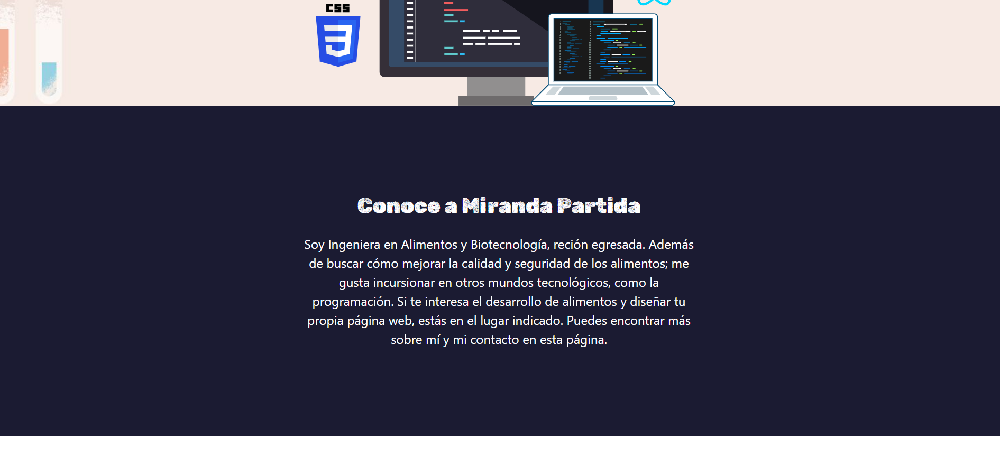
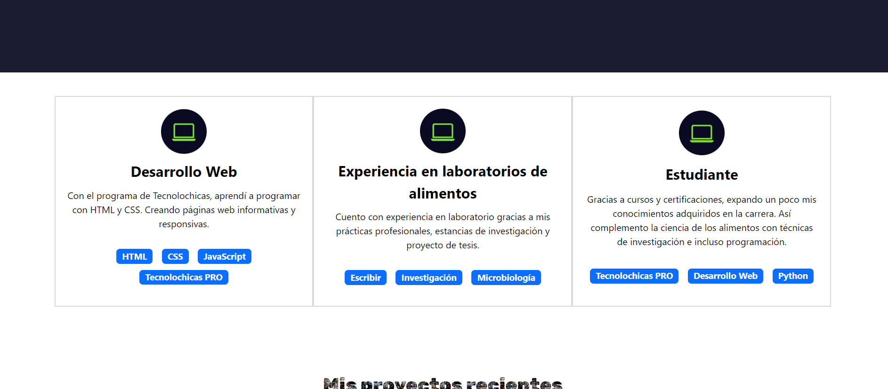
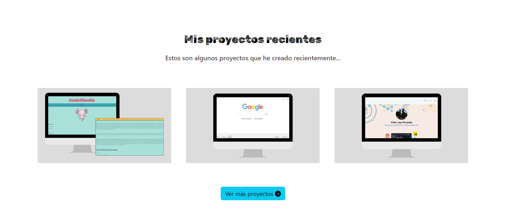

# Portafolio Adaptable (Responsive) con Bootstrap 5 elaborado por MIRANDA PARTIDA

En este proyecto se puso a prueba loaprendido duranto el bootcamp Tecnolochicas PRO. Es una página web adaptable a dispositivos de distintos tamaños.

El propósito de la página web es mostrr el portafolio de los proyectos además de presentar mis experiencias, motivación y redes de contacto. Actúa a modo de presentación profesional de mi persona.

### Capturas de pantalla:

Primera parte de la página web:

Presentación:

Experiencia:

Proyectos:

Contacto:

## Tecnologías

Esta página web fue creada con:

* HTML
* CSS
* JavaScript 
* Bootstrap 5

Además, se incluyeron **Google Fonts** para personalizar la fuente y **Bootstrap icons** para incorporar íconos como flechas y logos de redes sociales populares. 

## Español

El texto de la página web está escrito en español, al igual que las clases y atributos personalizados. Las clases relacionadas con Bootstrap se incluyeron en inglés.

